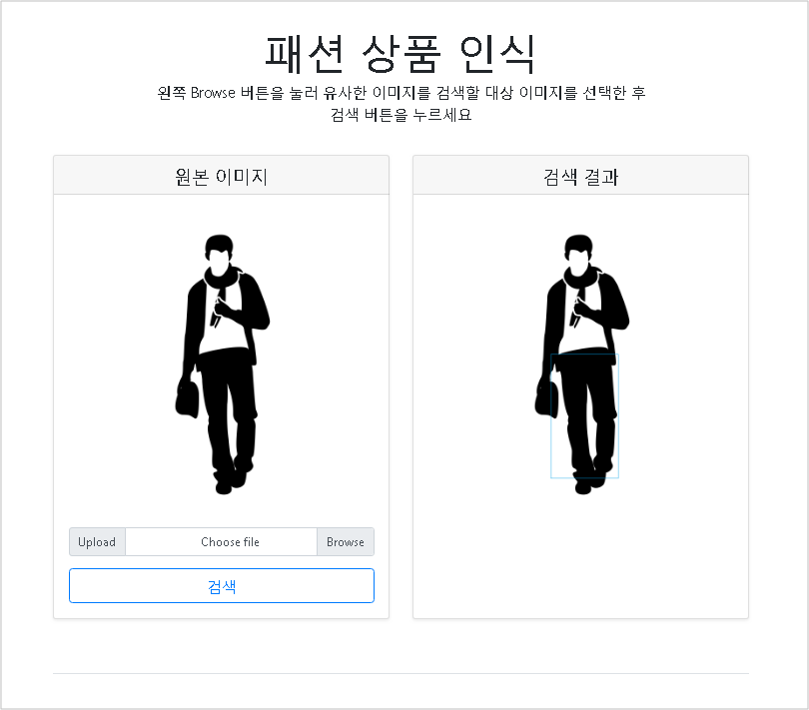
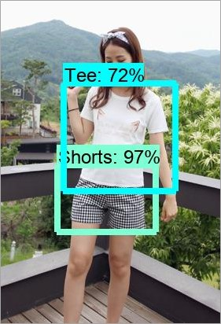
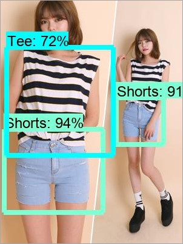
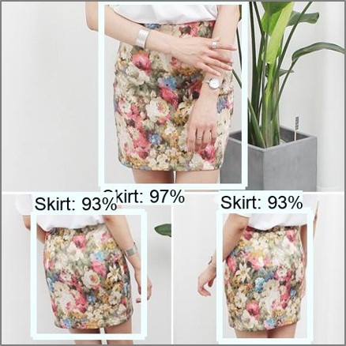

# 
# 패션 상품 검출 시스템

  

## 시스템 배경 및 목적

* 유사 패션 상품 검색 시스템을 위한 이미지 내 패션 상품 검출 모듈이 탑재된 시스템으로, 광고 이미지 내 패션 상품의 영역과 종류를 검출함

## 시스템 환경 

* python 3.6
* django 
* tensorflow
* PIL
* scipy

## 패션 상품 검출 모델 

* 총 5가지 카테고리(티셔츠, 블라우스, 반바지, 치마, 원피스) 상품을 검출할 수 있음
* Faster R-CNN 모델 활용
* 약 84%의 mAP@0.5IoU를 갖음

## 검출 테스트 결과 

  
  
  

