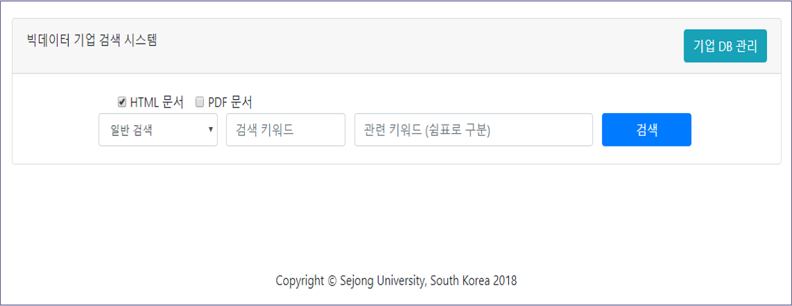
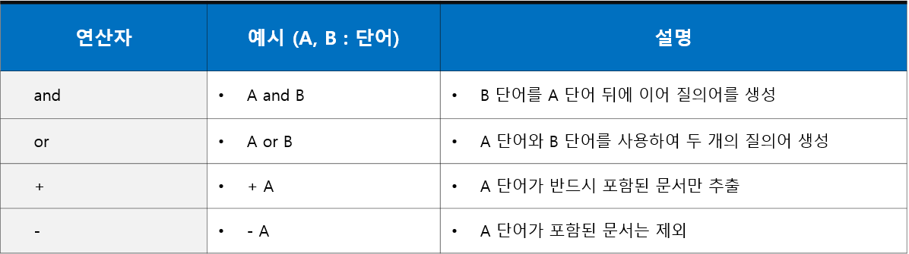
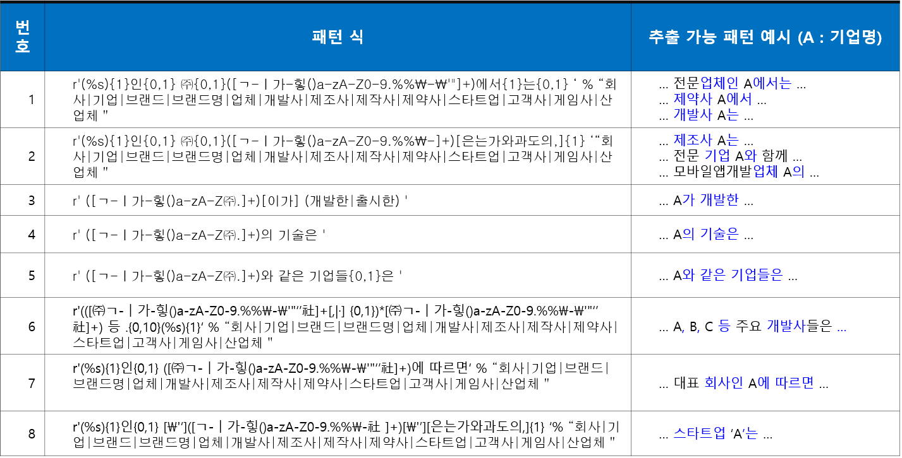
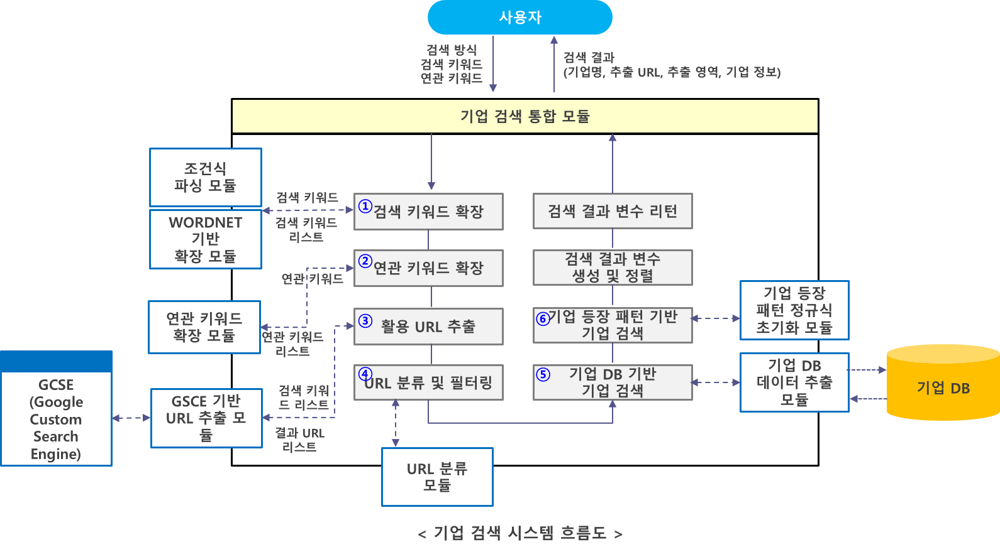
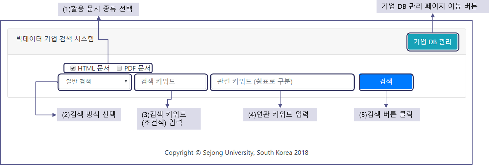
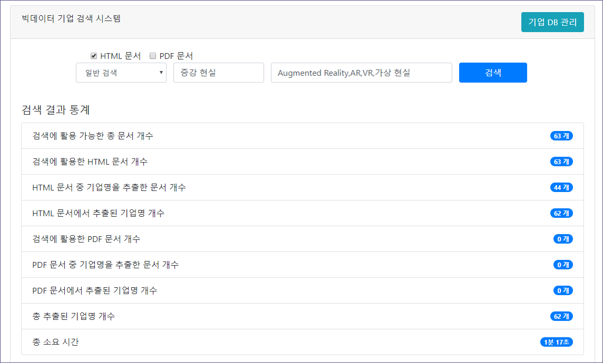
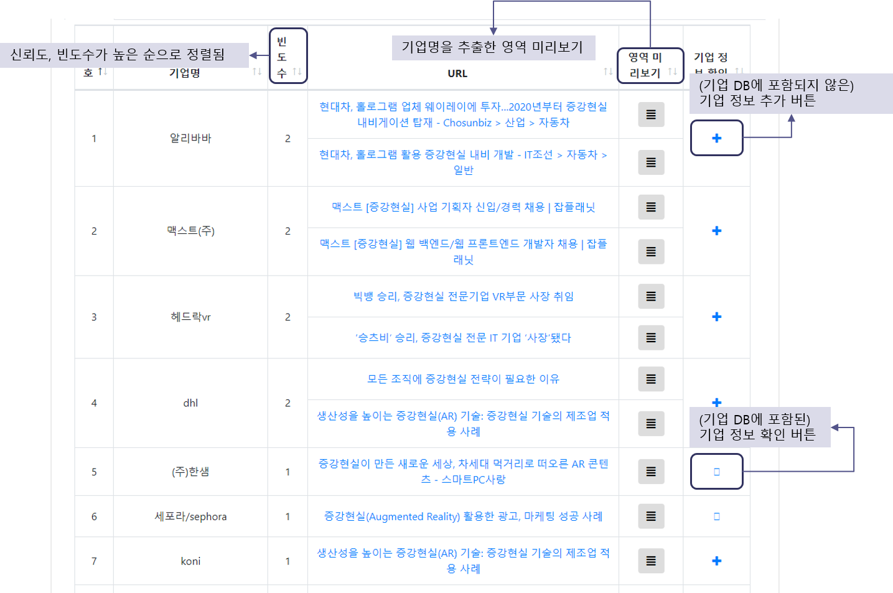
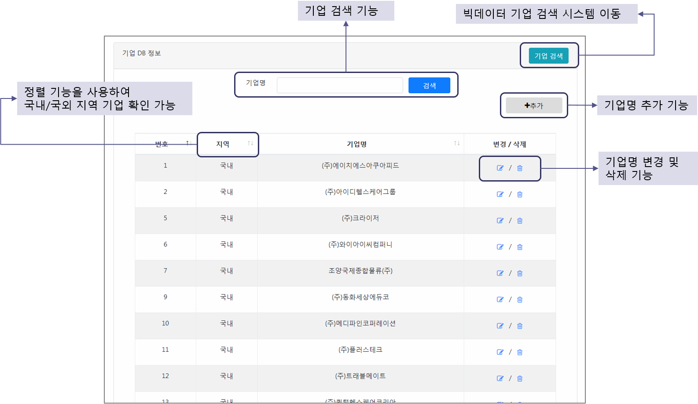

# 
# 빅데이터 기업 검색 시스템 

  

## 시스템 배경 및 목적

* 대학에서 보유하고 있는 우수 기술을 확산 및 활용하기 위한 빅데이터 기반 수요 기업 검색 서비스 필요
* 키워드를 활용한 사용자 맞춤형 수요 기업 검색 서비스의 개발

## 시스템 세부 모듈 

* Google Custom Search API 기반 키워드 관련 URL 검색 모듈
* 검색 키워드 확장 모듈 (WordNet 기반 검색어 확장 모듈, 조건식 기반 확장 모듈)
  * 활용 문서 URL을 최대한 늘리기 위하여 검색 키워드를 확장, 다양한 검색 키워드를 사용하여 검색
* 기업 DB 기반 기업명 추출 모듈
* 기업명 등장 패턴 기반 기업명 추출 모듈

## WordNet 기반 유사어/동의어 검색어 확장 모듈
* NLTK 내 WordNet 패키지에서 제공하는 유사어/동의어 추출 함수를 활용하여 검색 키워드 확장
* ex) "혈당 센서" -> "혈당 탐지기"
* 확장 순서
1. 키워드 내 명사 N개 추출 
2. 각 명사를 영어로 번역 (Google Translate API 활용)
3. 각 명사의 유사어(동의어) M개 확인 (WordNet 활용)
4. 유사어(동의어)가 존재하는 경우 다시 한글로 번역(Google Translate API 활용)
5. 기존 키워드 내 명사를 유사어(동의어)로 대체
6. N x M 개의 확장된 유사어(동의어)들을 포함한 리스트 변수 반환

## 조건식 기반 확장 모듈
* 조건식을 활용하여 다양한 키워드로 검색할 수 있는 기능 제공
* ex) "비침습 and 혈당 and (센서 or 측정기) – 침습")

  

## 기업 DB 기반 기업명 추출 모듈 
* 문서 내 기업명 및 대체 기업명 포함 여부 확인

## 기업명 등장 패턴 기반 기업명 추출 모듈 
* 기업명이 빈번하게 등장하는 특정 패턴을 찾아 정의하고, 이를 기반으로 기업명 포함 여부 확인

  

  

## 시스템 구성 및 흐름도

  

## 시스템 화면

* 메인 화면

  

* 검색 결과 화면

  
  

* 기업 DB 관리 화면 

  

